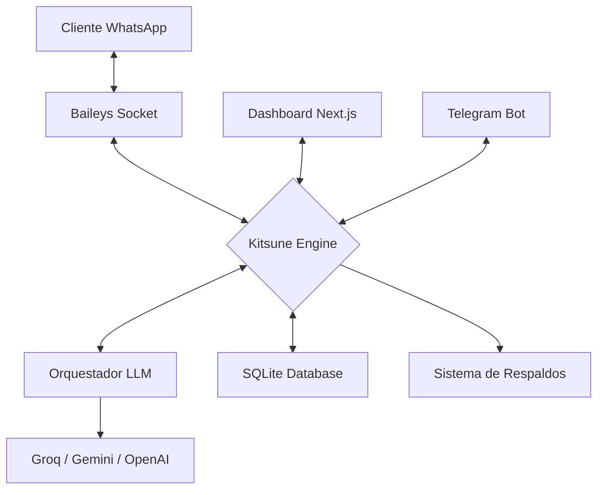

<h1 align="center">🦊 BotMaRe - Gravity Dashboard</h1>

<p align="center">
  <strong>La plataforma definitiva de automatización para WhatsApp impulsada por Inteligencia Artificial de alta disponibilidad.</strong>
</p>

<p align="center">
  
  
  
  
  
</p>

---

## 📖 Visión General

**BotMaRe** es un ecosistema de automatización para WhatsApp diseñado para ser robusto, privado y extremadamente inteligente. A diferencia de otros bots, BotMaRe utiliza un **Orquestador de IA con Failover**, asegurando que el bot siempre responda incluso si un proveedor (como OpenAI o Groq) falla.

Su diseño **Glassmorphism** premium ("Gravity Design") ofrece una experiencia de usuario de nivel empresarial, permitiendo gestionar difusiones masivas, recordatorios y personalidades de IA desde una interfaz intuitiva y responsiva.

---

## 🏗️ Arquitectura del Sistema

El sistema utiliza un flujo de datos asíncrono para garantizar que ninguna petición se pierda y que la IA siempre tenga contexto actualizado:



### Componentes Clave:
*   **Kitsune Engine (Backend)**: Escrito en TypeScript, maneja la lógica de negocio, colas de mensajes y auditoría.
*   **Orquestador LLM**: Un sistema inteligente que rota entre 5 proveedores de IA según disponibilidad y costo.
*   **Gravity UI (Frontend)**: Interfaz Next.js optimizada para el rendimiento con componentes modulares.
*   **Persistence Layer**: Base de datos SQLite local que garantiza que tus datos nunca salgan de tu servidor.

---

## ✨ Características Analíticas

### 🧠 Orquestación de IA (Failover Dinámico)
BotMaRe no depende de una sola "mente". Si un proveedor de IA experimenta latencia o caídas, el sistema escala automáticamente:
1.  **Groq**: Velocidad ultra-rápida (Llama 3).
2.  **Google Gemini**: Análisis de contexto profundo y visión de imágenes.
3.  **OpenAI**: Estabilidad absoluta y precisión en lógica compleja.
4.  **OpenRouter / NVIDIA**: Acceso a modelos especializados como DeepSeek V4.

### 🛡️ Seguridad y Escudo de Inyección
Implementamos un **Escudo de Seguridad** en el prompt del sistema. Cualquier intento del usuario por manipular las instrucciones del bot ("Prompt Injection") es detectado y bloqueado por la arquitectura de capas del mensaje.

### 🔄 Persistencia de Sesión SQLite
A diferencia del método tradicional de archivos JSON, utilizamos **SQLite para la autenticación de Baileys**. Esto evita la corrupción de archivos, mejora la velocidad de lectura y permite una portabilidad total del sistema sin perder la conexión.

### 📦 Sistema de Mantenimiento Autónomo
*   **Backups diarios**: Envío automático de la base de datos y config al Telegram del dueño cada madrugada a las 3 AM.
*   **Purga Inteligente**: El sistema detecta y elimina multimedia huérfana de más de 3 días para optimizar el almacenamiento del servidor.

---

## 🚀 Guía de Instalación

### 📋 Requisitos Previos
| Software | Versión | Enlace |
| :--- | :--- | :--- |
| **Node.js** | v18+ | [nodejs.org](https://nodejs.org) |
| **API Key** | Mínimo 1 | [Groq Console](https://console.groq.com/keys) |

### Paso 1 — Clonar y Setup
<details open>
<summary>⭐ <strong>Método Automático (Recomendado)</strong></summary>

1. Descarga el ZIP o clona el repo.
2. Ejecuta **`setup.bat`**. Este script instalará todas las dependencias de los 3 módulos y preparará tus archivos `.env`.
</details>

<details>
<summary>🛠️ <strong>Método Manual (Desarrolladores)</strong></summary>

```bash
npm run install-all
cp backend/.env.example backend/.env
cp frontend/.env.example frontend/.env
```
</details>

### Paso 2 — Configuración
Edita el archivo `backend/.env` y pega tus API Keys. Si quieres habilitar los respaldos, asegúrate de poner tu `TELEGRAM_BOT_TOKEN`.

### Paso 3 — Iniciar
```bash
# Opción rápida:
npm_run_dev.bat

# Opción manual:
npm run dev
```

---

## 🛡️ Sistema de Respaldo y Seguridad

BotMaRe incluye un sistema de backup híbrido para que nunca pierdas tu configuración:

*   **🤖 Backup Automático**: Configura tu ID en Telegram y recibe un `.zip` diario con toda tu información.
*   **🔄 Restauración Express**: 
    - **Dashboard**: Sube tu `.zip` en la pestaña de Configuración.
    - **Telegram**: Reenvía el archivo al bot con el comando `/restaurar`. El sistema se reiniciará automáticamente.

---

## 🔑 Proveedores de IA Soportados

| Proveedor | Gratuito | Variable en `.env` | Ventaja |
| :--- | :--- | :--- | :--- |
| **Groq** ⭐ | ✅ Sí | `GROQ_API_KEY` | Velocidad extrema. |
| **Gemini** | ✅ Sí | `GEMINI_API_KEY` | Visión y contexto largo. |
| **OpenAI** | ❌ Pago | `OPENAI_API_KEY` | Estabilidad total. |
| **OpenRouter**| ✅ Sí | `OPENROUTER_API_KEY` | Modelos Free. |
| **NVIDIA** | ❌ Pago | `NVIDIA_API_KEY` | DeepSeek V4 Pro. |

---

## 🎨 Marca Blanca (Custom Branding)

Puedes personalizar la plataforma para tu propio uso o clientes:
*   `NEXT_PUBLIC_APP_NAME`: Cambia el nombre en el Dashboard y el pie de página.
*   `bot_name`: Cambia cómo se identifica la IA en el chat.
*   `system_prompt`: Define la personalidad única de tu bot.

---

## 📁 Estructura del Proyecto
```
BotMaRe/
├── backend/                  # Motor Kitsune (Express + Sockets)
│   ├── src/core/             # Lógica de IA, Memoria y Orquestación
│   ├── src/whatsapp/         # Handlers y Conexión Baileys
│   ├── src/telegram/         # Bot de Gestión Remota
│   └── data/                 # Bases de Datos SQLite e Imágenes
├── frontend/                 # Gravity UI (Next.js 16)
├── setup.bat                 # Instalador Automático
└── build_exe.bat             # Generador de Ejecutable (Desarrollo)
```

---

## 🏷️ Variables Inteligentes (Plantillas)
Usa estas etiquetas en tus mensajes para personalizarlos:
*   `{NOMBRE}`: Nombre completo del contacto.
*   `{NOMBRE_PILA}`: Solo el primer nombre.
*   `{FECHA}` / `{HORA_12}`: Información temporal actual.
*   `{DIA_SEMANA}`: Lunes, Martes, etc.

---

## ❓ Solución de Problemas
<details>
<summary><strong>El QR no carga o se queda en blanco</strong></summary>
Asegúrate de que el puerto 3001 no esté siendo usado por otro programa. Verifica que tengas conexión a internet.
</details>

<details>
<summary><strong>Error de autenticación en el Dashboard</strong></summary>
Por defecto es Usuario: `admin` y Contraseña: `admin123`. Puedes cambiarlos en `frontend/.env`.
</details>

<details>
<summary><strong>La IA no responde</strong></summary>
Verifica tus API Keys en el Dashboard (Pestaña Configuración). Si usas Groq, asegúrate de no haber excedido el límite de tokens gratuitos.
</details>

---

<p align="center">
  Desarrollado con ❤️ por <strong><a href="https://github.com/LedezmaSune">LedezmaSune</a></strong><br/>
  Impulsado por <strong>Kitsune Engine</strong> 🦊
</p>
