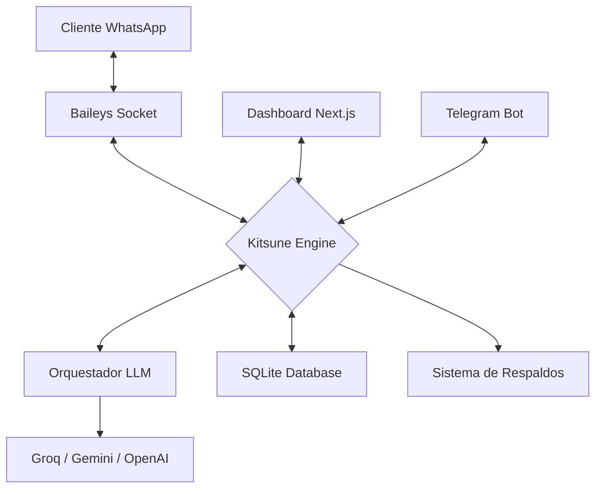

# 🦊 BotMaRe — The Gravity Dashboard
> **Automatización Inteligente de WhatsApp con Arquitectura de Alta Disponibilidad**

[](https://nodejs.org)
[](https://nextjs.org)
[](https://sqlite.org)
[](LICENSE)

---

## 📖 Visión General

**BotMaRe** es un ecosistema de automatización para WhatsApp diseñado para ser robusto, privado y extremadamente inteligente. A diferencia de otros bots, BotMaRe utiliza un **Orquestador de IA con Failover**, asegurando que el bot siempre responda incluso si un proveedor (como OpenAI o Groq) falla.

Su diseño **Glassmorphism** premium ("Gravity Design") ofrece una experiencia de usuario de nivel empresarial, permitiendo gestionar difusiones masivas, recordatorios y personalidades de IA desde una interfaz intuitiva.

---

## 🏗️ Arquitectura del Sistema

El sistema se divide en tres capas fundamentales que trabajan en sincronía:



### Componentes Clave:
*   **Kitsune Engine (Backend)**: Escrito en TypeScript, maneja la lógica de negocio, colas de mensajes y auditoría.
*   **Orquestador LLM**: Un sistema inteligente que rota entre 5 proveedores de IA según disponibilidad y costo.
*   **Gravity UI (Frontend)**: Interfaz Next.js optimizada para el rendimiento con componentes modulares.
*   **Persistence Layer**: Base de datos SQLite local que garantiza que tus datos nunca salgan de tu servidor.

---

## ✨ Características Analíticas

### 🧠 Orquestación de IA (Failover Dinámico)
BotMaRe no depende de una sola "mente". Si un proveedor de IA experimenta latencia o caídas, el sistema escala automáticamente:
1.  **Groq**: Velocidad ultra-rápida (Llama 3).
2.  **Google Gemini**: Análisis de contexto profundo.
3.  **OpenAI**: Estabilidad y precisión.
4.  **OpenRouter / NVIDIA**: Acceso a modelos especializados como DeepSeek.

### 🛡️ Seguridad y Escudo de Inyección
Implementamos un **Escudo de Seguridad** en el prompt del sistema. Cualquier intento del usuario por manipular las instrucciones del bot ("Prompt Injection") es detectado y bloqueado por la arquitectura de capas del mensaje.

### 🔄 Persistencia de Sesión SQLite
A diferencia del método tradicional de archivos JSON, utilizamos **SQLite para la autenticación de Baileys**. Esto evita la corrupción de archivos y permite una portabilidad total del sistema sin perder la conexión.

### 📦 Sistema de Mantenimiento Autónomo
*   **Backups diarios**: Envío automático de la base de datos y config al Telegram del dueño.
*   **Purga Inteligente**: El sistema detecta y elimina multimedia huérfana de más de 3 días para optimizar el almacenamiento.

---

## 🚀 Guía de Instalación

### Opción A: El Método "Un Clic" (Para Todos)
1.  Descarga el proyecto y descomprímelo.
2.  Ejecuta **`setup.bat`** (instala todo automáticamente).
3.  Configura tu API Key en el archivo `.env`.
4.  Inicia con **`npm_run_dev.bat`**.

### Opción B: Ejecutable Portátil (Beta)
Si prefieres no instalar nada, ejecuta **`build_exe.bat`**. Esto generará una carpeta `En_Desarrollo_Portable` con un único archivo `.exe` que contiene todo el sistema.

### Opción C: Instalación Profesional (Desarrolladores)
```bash
# Clonar e instalar
git clone https://github.com/LedezmaSune/BotMaRe.git
npm run install-all

# Configurar
cp backend/.env.example backend/.env
# Edita las llaves en el archivo .env

# Iniciar
npm run dev
```

---

## 🎨 Personalización (White-Label)

BotMaRe está diseñado para ser marca blanca. Puedes personalizarlo editando el archivo `.env`:

*   `NEXT_PUBLIC_APP_NAME`: Cambia el nombre de toda la plataforma.
*   `bot_name`: Cambia el nombre con el que la IA se presenta.
*   `system_prompt`: Define la "chispa" o personalidad de tu asistente.

---

## ❓ Solución de Problemas Frecuentes

| Problema | Solución Analítica |
| :--- | :--- |
| **Error de Socket** | Revisa que el puerto 3001 esté libre. El sistema usa WebSockets para comunicación en tiempo real. |
| **IA Lenta** | El orquestador espera 15s por proveedor. Prueba a usar Groq como prioridad 1 para respuestas instantáneas. |
| **Pérdida de QR** | El QR se refresca automáticamente cada 60s. Asegúrate de tener una conexión estable a internet. |

---

<p align="center">
  Diseñado con rigor técnico por <strong><a href="https://github.com/LedezmaSune">LedezmaSune</a></strong><br/>
  Impulsado por el motor <strong>Kitsune Engine</strong> 🦊
</p>
