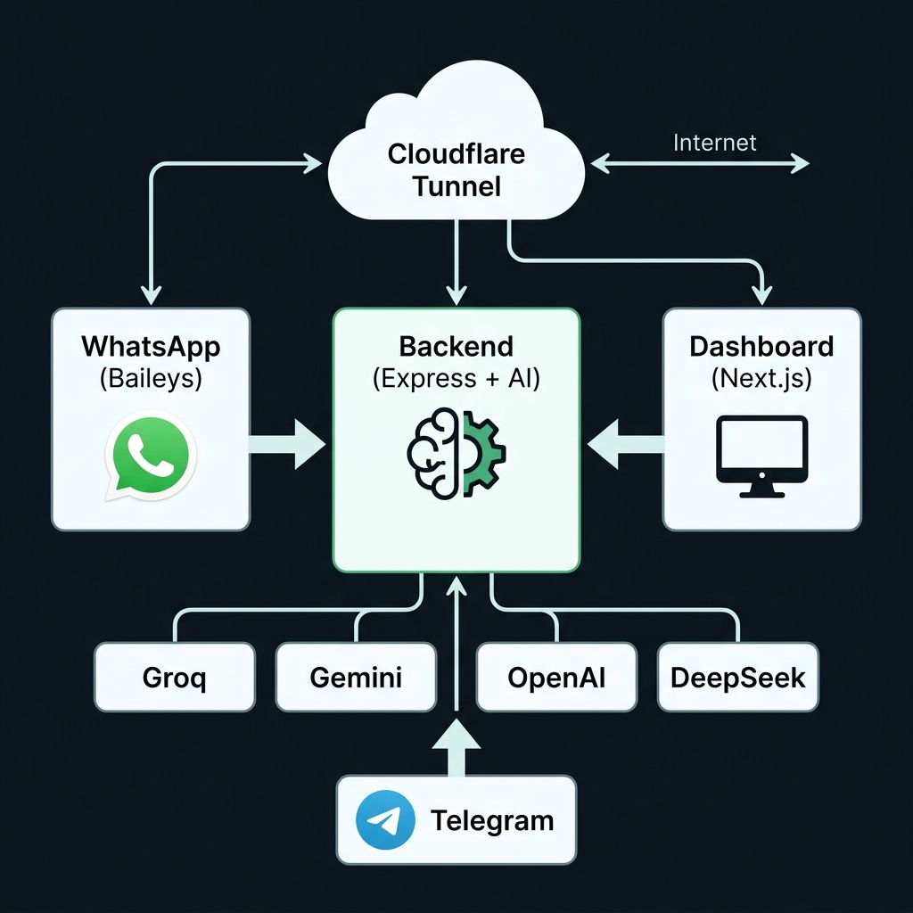

<h1 align="center">🦊 BotMaRe - Gravity Dashboard</h1>

<p align="center">
  <strong>La plataforma definitiva de automatización para WhatsApp impulsada por Inteligencia Artificial.</strong>
</p>

<p align="center">
  
  
  
  
  
</p>

---

## 📖 ¿Qué es BotMaRe?

BotMaRe (powered by **Kitsune Engine**) transforma tu WhatsApp en una herramienta de negocios inteligente. Combina múltiples modelos de IA, automatización de mensajes y un panel de control premium con diseño **Glassmorphism**.

### Arquitectura

<p align="center">
  
</p>

---

## ✨ Características

| Módulo                    | Funcionalidades                                                               |
| ------------------------- | ----------------------------------------------------------------------------- |
| 🧠 **IA Multi-Proveedor** | Groq, Gemini, OpenAI, DeepSeek (NVIDIA), OpenRouter — con failover automático |
| 📱 **WhatsApp Bot**       | Respuestas inteligentes, imágenes, audio, documentos                          |
| 📢 **Difusión Masiva**    | Envía mensajes personalizados a listas de contactos                           |
| 📅 **Recordatorios**      | Programa mensajes: cada hora, día, semana, mes o personalizado                |
| 🗓️ **Calendario Gravity** | Vista tipo Google Calendar para gestionar recordatorios                       |
| ✈️ **Telegram Bot**       | Controla el sistema remotamente desde Telegram                                |
| 📄 **Plantillas**         | Crea, edita y reutiliza mensajes con variables inteligentes                   |
| 🌐 **Tunnel Automático**  | Cloudflare Tunnel integrado para acceso remoto                                |
| 🎨 **Dashboard Premium**  | Glassmorphism, modo oscuro/claro, micro-animaciones                           |

---

## 🚀 Instalación Rápida

### Requisitos Previos

| Software    | Versión Mínima | Enlace                                       |
| ----------- | -------------- | -------------------------------------------- |
| **Node.js** | v18+           | [nodejs.org](https://nodejs.org)             |
| **Git**     | Cualquiera     | [git-scm.com](https://git-scm.com)           |
| **API Key** | Al menos 1     | Ver [Proveedores de IA](#-proveedores-de-ia) |

### Paso 1 — Clonar el repositorio

```bash
git clone https://github.com/LedezmaSune/BotMaRe.git
cd BotMaRe
```

### Paso 2 — Instalar dependencias

<details open>
<summary>⭐ <strong>Instalación Manual</strong> (Recomendada)</summary>

Ejecuta los siguientes comandos en la terminal desde la raíz del proyecto:

```bash
npm install
cd backend && npm install && cd ..
cd frontend && npm install && cd ..
```

Luego configura tus variables de entorno:

```bash
cp backend/.env.example backend/.env
cp frontend/.env.example frontend/.env
```

Edita `backend/.env` con tus API Keys (ver [Proveedores de IA](#-proveedores-de-ia)) y `frontend/.env` con tus credenciales del dashboard.

> **💡 Tip:** Este es el método más confiable y funciona en **cualquier sistema operativo** (Windows, Linux, Mac).

</details>

<details>
<summary>🐳 <strong>Docker</strong> (Servidores 24/7)</summary>

```bash
docker-compose up -d --build
```

Ideal para despliegues en producción con VPS.

</details>

<details>
<summary>🐧 <strong>Linux / 🍎 Mac</strong> — Notas adicionales</summary>

> **Ubuntu/Debian**: Si no tienes Node.js:
>
> ```bash
> curl -fsSL https://deb.nodesource.com/setup_20.x | sudo -E bash -
> sudo apt install -y nodejs
> ```

> **Mac con Homebrew**:
>
> ```bash
> brew install node
> ```

</details>

<details>
<summary>🧪 <strong>Scripts Automáticos</strong> (Experimental — en desarrollo)</summary>

> [!WARNING]
> Estos scripts están **en desarrollo activo** y pueden presentar comportamientos inesperados.
> Se recomienda usar la **instalación manual** descrita arriba.

**Windows** — `setup.bat`:

```cmd
setup.bat
```

**Linux/Mac** — `setup.sh`:

```bash
chmod +x setup.sh
./setup.sh
```

Los scripts intentan automatizar la instalación de dependencias y la configuración de archivos `.env`, pero aún no son estables para todos los entornos.

</details>

### Paso 3 — Iniciar el sistema

```bash
npm run dev
```

Esto arranca **Backend (puerto 3001)** y **Frontend (puerto 3000)** simultáneamente.

```
  BACKEND   🚀 KITSUNE ENGINE activo en: http://localhost:3001
  BACKEND   🌍 TUNEL ACTIVADO: https://xxx.trycloudflare.com
  FRONTEND  ▲ Next.js 16 - http://localhost:3000
  BACKEND   🚀 Orchestrator Boot Sequence Completed!
```

### Paso 4 — Vincular WhatsApp

1. Abre **[http://localhost:3000](http://localhost:3000)** en tu navegador
2. Verás el **Dashboard de Gravity**
3. Aparecerá un **código QR** — escanéalo con tu celular:
   - WhatsApp → **⋮ Menú** → **Dispositivos vinculados** → **Vincular dispositivo**
4. ¡Listo! El estado cambiará a **Conectado** 🟢

---

## 🔑 Proveedores de IA

BotMaRe soporta **5 proveedores** con failover automático. Solo necesitas **al menos 1**:

| Proveedor             | Gratuito     | Obtener Key                                                   | Variable en `.env`   |
| --------------------- | ------------ | ------------------------------------------------------------- | -------------------- |
| **Groq** ⭐           | ✅ Sí        | [console.groq.com/keys](https://console.groq.com/keys)        | `GROQ_API_KEY`       |
| **Google Gemini**     | ✅ Sí        | [aistudio.google.com](https://aistudio.google.com/app/apikey) | `GEMINI_API_KEY`     |
| **OpenRouter**        | ✅ Free tier | [openrouter.ai/keys](https://openrouter.ai/keys)              | `OPENROUTER_API_KEY` |
| **OpenAI**            | ❌ Pago      | [platform.openai.com](https://platform.openai.com/api-keys)   | `OPENAI_API_KEY`     |
| **DeepSeek (NVIDIA)** | ❌ Pago      | [integrate.api.nvidia.com](https://integrate.api.nvidia.com)  | `NVIDIA_API_KEY`     |

> **💡 Tip:** Puedes poner **múltiples keys separadas por comas** para mayor capacidad:
>
> ```
> GROQ_API_KEY=key1,key2,key3
> ```
>
> Si una key alcanza su límite, el sistema pasa automáticamente a la siguiente.

---

## ⚙️ Configuración Manual del `.env`

Si no usaste el script de setup, copia los archivos de ejemplo:

```bash
cp backend/.env.example backend/.env
cp frontend/.env.example frontend/.env
```

### `backend/.env`

```env
PORT=3001

# IA Providers (al menos 1 requerido)
GROQ_API_KEY=gsk_tu_key_aqui
GEMINI_API_KEY=
OPENAI_API_KEY=
NVIDIA_API_KEY=
OPENROUTER_API_KEY=

# Telegram (opcional)
TELEGRAM_BOT_TOKEN=tu_token_de_botfather
TELEGRAM_ALLOWED_USER_IDS=tu_id_numerico

# Sistema
DASHBOARD_URL=http://localhost:3000
NODE_ENV=development
LOGGER_LEVEL=error
```

### `frontend/.env`

```env
DASHBOARD_USER="admin"
DASHBOARD_PASS="tu_password_seguro"
```

> **💡 Tip:** Si no configuras estas variables, el sistema usará por defecto:
> - **Usuario:** `admin`
> - **Contraseña:** `admin123`

---

## 📁 Estructura del Proyecto

```
BotMaRe/
├── backend/                  # API + Motor de IA
│   ├── src/
│   │   ├── core/             # Agente IA, LLM, memoria, voz
│   │   ├── whatsapp/         # Conexión Baileys, handlers
│   │   ├── telegram/         # Bot de Telegram
│   │   ├── services/         # Lógica de negocio
│   │   ├── routes/           # Endpoints REST
│   │   ├── tools/            # Herramientas del agente (hora, web, recordatorios)
│   │   ├── modules/          # Scheduler, difusión masiva
│   │   └── index.ts          # Punto de entrada
│   ├── data/                 # Base de datos SQLite
│   ├── .env                  # Variables de entorno (no se sube a GitHub)
│   └── .env.example          # Plantilla de referencia
│
├── frontend/                 # Dashboard Next.js
│   ├── app/                  # Páginas (App Router)
│   ├── components/           # Componentes React
│   ├── hooks/                # Custom hooks (useBotData, useWhatsApp)
│   ├── types/                # Tipos TypeScript
│   ├── .env                  # Credenciales del dashboard
│   └── .env.example          # Plantilla de referencia
│
├── setup.bat                 # Setup rápido Windows
├── setup.sh                  # Setup rápido Linux/Mac
├── docker-compose.yml        # Deploy con Docker
└── package.json              # Scripts raíz (npm run dev)
```

---

## 🏷️ Variables Inteligentes

Al redactar mensajes en el dashboard, puedes usar variables que se reemplazan automáticamente:

| Variable        | Resultado        | Ejemplo    |
| --------------- | ---------------- | ---------- |
| `{NOMBRE}`      | Nombre completo  | Juan Pérez |
| `{NOMBRE_PILA}` | Primer nombre    | Juan       |
| `{APELLIDO}`    | Apellidos        | Pérez      |
| `{FECHA}`       | Fecha actual     | 01/05/2026 |
| `{HORA_12}`     | Hora 12h         | 2:30 PM    |
| `{HORA_24}`     | Hora 24h         | 14:30      |
| `{DIA_SEMANA}`  | Día de la semana | Jueves     |

---

## 📜 Scripts Disponibles

| Comando                         | Descripción                           |
| ------------------------------- | ------------------------------------- |
| `npm run dev`                   | Inicia Backend + Frontend juntos      |
| `npm run install-all`           | Instala dependencias en los 3 módulos |
| `npm run dev --prefix backend`  | Solo el backend                       |
| `npm run dev --prefix frontend` | Solo el frontend                      |

---

## ❓ Solución de Problemas

<details>
<summary><strong>El QR no aparece</strong></summary>

- Verifica que el backend esté corriendo en el puerto 3001
- Revisa la terminal por errores
- Intenta borrar `backend/data/whatsapp_auth.db` y reiniciar

</details>

<details>
<summary><strong>El bot no responde mensajes</strong></summary>

- Verifica que tienes al menos 1 API Key configurada en `backend/.env`
- Revisa los logs: debería aparecer `[LLM] Provider Responded successfully`
- Si ves `Timeout after 15000ms`, esa key no está respondiendo — prueba con otro proveedor

</details>

<details>
<summary><strong>Error "npm install" falla</strong></summary>

- Asegúrate de tener Node.js v18+ (`node -v`)
- En Linux/Mac puede necesitar: `sudo npm install`
- Borra `node_modules` y `package-lock.json` e intenta de nuevo

</details>

<details>
<summary><strong>Los mensajes dicen "Usuario" en vez del nombre</strong></summary>

- Al enviar difusiones, escribe los contactos como: `Juan 5212345678`
- Si no pones nombre, el bot usa "Usuario" por defecto

</details>

<details>
<summary><strong>Error de permisos en scripts (Linux/Mac)</strong></summary>

```bash
chmod +x setup.sh
```

</details>

---

## 🤝 Contribuir

1. Fork del repositorio
2. Crea tu rama: `git checkout -b feature/mi-mejora`
3. Commit: `git commit -m "feat: agregar nueva función"`
4. Push: `git push origin feature/mi-mejora`
5. Abre un Pull Request

---

<p align="center">
  Desarrollado con ❤️ por <strong><a href="https://github.com/LedezmaSune">LedezmaSune</a></strong><br/>
  Impulsado por <strong>Kitsune Engine</strong> 🦊
</p>
