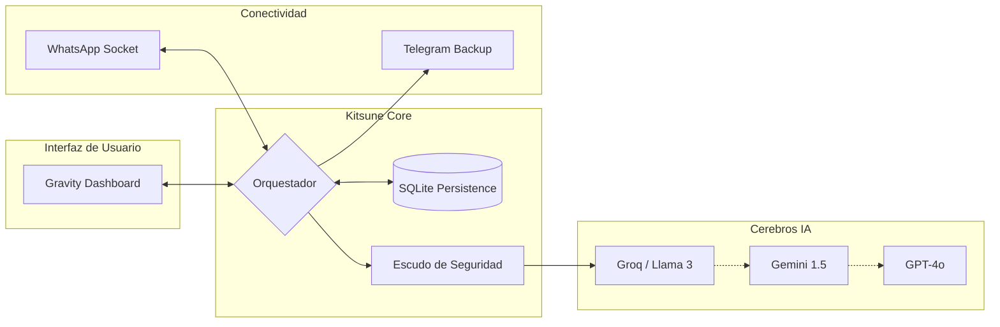

<h1 align="center">🦊 BotMaRe - Gravity Dashboard</h1>

<p align="center">
  <strong>La plataforma definitiva de automatización para WhatsApp impulsada por Inteligencia Artificial de alta disponibilidad.</strong>
</p>

<p align="center">
  
  
  
  
  
</p>

---

## 📖 ¿Qué es BotMaRe?

**BotMaRe** (powered by **Kitsune Engine**) transforma tu WhatsApp en una herramienta de negocios inteligente. No es solo un bot; es un ecosistema completo que combina múltiples modelos de IA con un orquestador de fallos (Failover), automatización de mensajes y un panel de control premium con diseño **Glassmorphism**.

### 🏗️ Arquitectura de Ingeniería

El sistema utiliza un flujo de datos asíncrono para garantizar que ninguna petición se pierda y que la IA siempre tenga contexto actualizado:



---

## ✨ Características Maestras

| Módulo | Funcionalidades Analíticas |
| :--- | :--- |
| 🧠 **IA Multi-Proveedor** | Groq, Gemini, OpenAI, DeepSeek, OpenRouter — con **Failover automático**. |
| 🛡️ **Seguridad Avanzada** | Escudo contra Prompt Injection y aislamiento de datos locales. |
| 📱 **WhatsApp Bot** | Respuestas inteligentes, soporte visual, audio (Whisper) y documentos. |
| 📢 **Difusión Masiva** | Envío inteligente con limpieza de números y variables dinámicas. |
| 📅 **Recordatorios** | Programación recurrente en grupos o privados con persistencia SQLite. |
| 🛡️ **Respaldos & Seg.** | Backup diario a Telegram y restauración en un clic (Dashboard/Telegram). |
| 🧹 **Auto-Limpieza** | Purga inteligente de archivos multimedia antiguos y backups caducados. |
| 🎨 **Marca Blanca** | Personalización total de nombre, logos y personalidad desde el `.env`. |

---

## 🚀 Guía de Instalación Rápida

### Requisitos Previos
| Software | Versión | Enlace |
| :--- | :--- | :--- |
| **Node.js** | v18+ | [nodejs.org](https://nodejs.org) |
| **API Key** | Mínimo 1 | [Groq Console](https://console.groq.com/keys) |

### Paso 1 — Descarga e Instalación
```bash
git clone https://github.com/LedezmaSune/BotMaRe.git
cd BotMaRe
```

### Paso 2 — Configuración de Entorno
<details open>
<summary>⭐ <strong>Método Automático (Windows)</strong></summary>

1. Haz doble clic en **`setup.bat`**. 
2. El script instalará las dependencias y creará tus archivos `.env`.
3. Edita `backend/.env` con tus API Keys.
</details>

<details>
<summary>🛠️ <strong>Método Manual (Pro)</strong></summary>

```bash
npm install
cd backend && npm install && cd ..
cd frontend && npm install && cd ..

# Configura los archivos .env
cp backend/.env.example backend/.env
cp frontend/.env.example frontend/.env
```
</details>

### Paso 3 — Iniciar el Sistema
```bash
# Usa el acceso directo en la raíz:
npm_run_dev.bat

# O manualmente:
npm run dev
```

---

## 🛡️ Sistema de Respaldo y Seguridad

BotMaRe incluye un sistema de backup híbrido para que nunca pierdas tu configuración:

*   **🤖 Backup Automático**: Cada madrugada (**3:00 AM**) el sistema envía un `.zip` a tu Telegram.
*   **🔄 Restauración Express**: Reenvía tu backup al bot con el comando `/restaurar` y el sistema se recuperará solo.
*   **🧹 Mantenimiento**: El bot limpia automáticamente la carpeta `uploads` de archivos que ya no necesita.

---

## 🔑 Proveedores de IA Soportados

| Proveedor | Prioridad | Ventaja Técnica |
| :--- | :--- | :--- |
| **Groq** | ⭐ 1 | Latencia ultra-baja y herramientas gratuitas. |
| **Gemini** | 🔵 2 | Gran ventana de contexto y visión de imágenes. |
| **OpenAI** | 🟢 3 | Estabilidad absoluta y precisión en lógica. |
| **NVIDIA** | 🟣 4 | Acceso a modelos potentes como DeepSeek V4. |

---

## 📁 Estructura del Proyecto
```
BotMaRe/
├── backend/                  # Kitsune Engine (API + IA)
│   ├── src/core/             # El "Cerebro" (Agent, LLM, Config)
│   ├── src/whatsapp/         # Conexión y Lógica de Sockets
│   └── data/                 # Bases de Datos SQLite (Sesión y Datos)
├── frontend/                 # Gravity Dashboard (Next.js)
├── build_exe.bat             # Generador de Ejecutable Portátil
└── setup.bat                 # Instalador Rápido
```

---

<p align="center">
  Desarrollado con ❤️ por <strong><a href="https://github.com/LedezmaSune">LedezmaSune</a></strong><br/>
  Impulsado por <strong>Kitsune Engine</strong> 🦊
</p>
